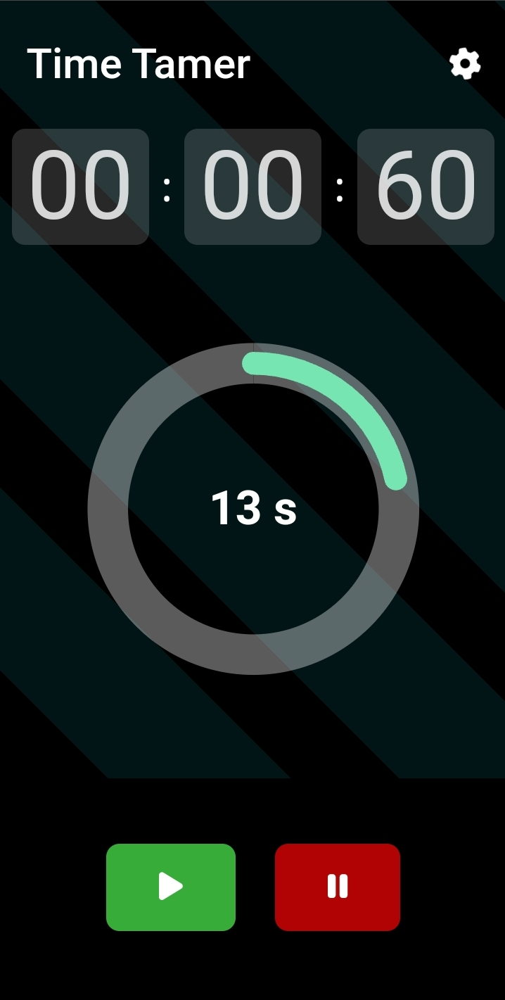

# Timer App


## Overview

Welcome to the Timer App! This simple yet powerful tool helps you manage your time effectively with precision and ease. Whether you're cooking, exercising, studying, or working, this app has got you covered.

# Timer App




...

## Features

- **Intuitive Interface:** User-friendly design for seamless navigation.
- **Customizable Timers:** Set timers for various activities and personalize them to suit your needs.
- **Multiple Modes:** Choose from countdown, stopwatch, and interval modes to match your task.
- **Notifications:** Receive timely alerts even when the app is running in the background.
- **History:** Keep track of your past timers for quick reference and analysis.
- **Dark Mode:** Switch to dark mode for a comfortable viewing experience, especially in low-light environments.

## Installation

To get started with the Timer App, simply clone the repository to your local machine:

```bash
git clone https://github.com/HaseebIqbal1199/TimeTamer.git 
